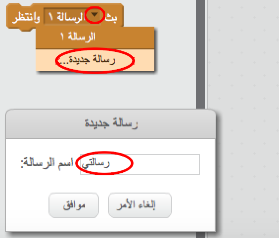
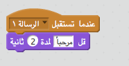

البث هو طريقة لإرسال إشارة من كائن لتتلقاها كل الكائنات، يُشبه ذلك إذاعة إعلان عبر مكبر صوت.

### إرسال البث

يمكنك إرسال البث عن طريق إنشاء قالب بث وتحديد اسم لها.

+ ابحث عن قالب البث بعلامة التبويب الأحداث.

+ حدِّد **رسالة جديدة** من القائمة المنسدلة، ثم اكتب رسالتك.

يمكنك كتابة أي نص للرسالة، لكن من المفيد إعطاء البث وصفاً منطقي. ماذا يحدث عند تلقي الرسالة تعتمد على تعليمات برمجية مكتوبة من قبلك.

### تلقى البث

الكائن يمكن أن يستجاب لبث بإستخدام هذا القالب البرامجي:

يمكنك إضافة قوالب برمجية أخرى أسفل هذا القالب البرمجي لتحدد للكائن ما يفعله عندما يتلقى إشارة البث.

