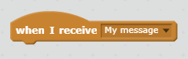

Излъчването е начин за изпращане на сигнал от спрайт, който може да бъде чут от всички спрайтове. Помислете за това като съобщение, направено върху високоговорител.

### Изпратете излъчване

Можете да изпратите излъчване, като създадете блок за излъчване и му дадете име.

+ Намерете излъчващия блок в раздела "Събития".

+ В падащото меню изберете **ново съобщение** , след което въведете съобщението си.

Текстът на съобщението може да бъде всичко, което ви харесва, но е полезно да дадете на излъчването разумно описание. Какво се случва, когато съобщението е получено, зависи от кода, който пишете.

### Получаване на предаване

Спрайт може да реагира на излъчване, като използва този блок:

Можете да добавите блокове под този блок, за да кажете на спрата какво да прави, когато получи сигнала за излъчване.

