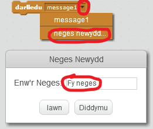
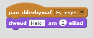

Mae darlledu yn ffordd o anfon signal gan giplun y gall pob ciplun ei glywed. Dychmyga gyhoeddiad gan uchelseinydd.

### Anfon darllediad

Gelli di anfon darllediad gan greu bloc darlledu a rhoi enw arno.

+ Dod o hyd i'r bloc darlledu yn y tab Digwyddiadau.

+ Dewis **neges newydd** yn y gwymplen, yna teipia dy neges.

Gelli di ysgrifennu unrhyw beth yn y neges, ond mae'n ddefnyddiol disgrifio'r darllediad yn synhwyrol. Mae'r hyn sy'n digwydd pan dderbynnir y neges yn dibynnu ar dy god.

### Derbyn darllediad

Gall ciplun ymateb i ddarllediad gan ddefnyddio'r bloc hwn:

Gelli di ychwanegu blociau o dan y bloc hwn i ddweud wrth y ciplun beth i'w wneud pan fydd yn derbyn y signal darlledu.

