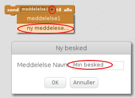
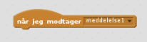
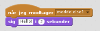

En meddelelse er en måde at sende et signal fra en sprite, som kan høres af alle sprites. Tænk på det som en meddelelse om en højttaler.

### Send en meddelelse

Du kan sende en meddelelse ved at oprette en send-blok og give det et navn.

+ Find send-blokken i fanen Hændelser.

+ Vælg **ny meddelelse** i rullemenuen, og indtast derefter din besked.

Meddelelses teksten kan være alt, hvad du kan finde på, men det er nyttigt at give beskeden en fornuftig beskrivelse. Hvad der sker, når beskeden er modtaget afhænger af koden, du skriver.

### Modtag en meddelelse

En sprite kan reagere på en meddelelse ved at bruge denne blok:

Du kan tilføje blokke under denne blok for at fortælle spriten hvad den skal gøre, når den modtager meddelelsen.

