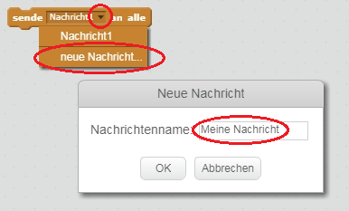
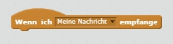
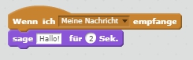

Eine Sendung an alle ist eine Möglichkeit, ein Signal von einer Figur zu senden, das von allen Figuren gehört werden kann. Stelle es dir vor wie eine Ansage über einen Lautsprecher.

### Eine Nachricht an alle senden

Du kannst eine Nachricht senden, indem du einen 'Sende Nachricht an alle'-Block erstellst und ihm einen Namen gibst.

+ Suche den 'Sende Nachricht an alle'-Block auf der Registerkarte Ereignisse.

+ Wähle **Neue Nachricht** im ausklappbaren Menü und gib deine Nachricht ein.

Der Nachrichtentext kann beliebig sein, aber es ist nützlich, der Sendung eine sinnvolle Beschreibung zu geben. Was passiert, wenn die Nachricht empfangen wird, hängt von dem Code ab, den Sie schreiben.

### Empfangen Sie eine Sendung

Ein Sprite kann mit diesem Block auf eine Übertragung reagieren:

Sie können Blöcke unterhalb dieses Blocks hinzufügen, um dem Sprite mitzuteilen, was zu tun ist, wenn es das Broadcast-Signal empfängt.

