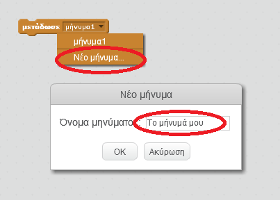
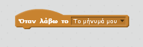
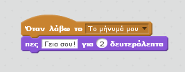

Μια εκπομπή είναι ένας τρόπος να στείλεις ένα σήμα από ένα αντικείμενο που μπορεί να ακουστεί από όλα τα αντικείμενα. Σκέψου το σαν μία ανακοίνωση από ένα μεγάφωνο.

### Εξέπεμψε ένα σήμα

Μπορείς να εκπέμψεις ένα σήμα δημιουργώντας ένα μπλοκ εκπομπής και δίνοντάς του ένα όνομα.

+ Βρες το μπλοκ εκπομπής στην καρτέλα Συμβάντα.

+ Επέλεξε το **νέο μήνυμα** από το αναπτυσσόμενο μενού και, στη συνέχεια, πληκτρολόγησε το μήνυμά σου.

Το κείμενο του μηνύματος μπορεί να είναι οτιδήποτε θέλεις, αλλά χρήσιμο είναι να δώσεις στην εκπομπή μία λογική περιγραφή. Αυτό που συμβαίνει όταν λαμβάνεται το μήνυμα εξαρτάται από τον κώδικα που γράφεις.

### Λήψη εκπεμπόμενου μηνύματος

Ένα αντικείμενο μπορεί να αντιδράσει σε μια εκπομπή μηνύματος χρησιμοποιώντας αυτό το μπλοκ:

Μπορείτε να προσθέσετε μπλοκ κάτω από αυτό το μπλοκ για να πείτε στο sprite τι πρέπει να κάνει όταν λάβει το σήμα εκπομπής.

