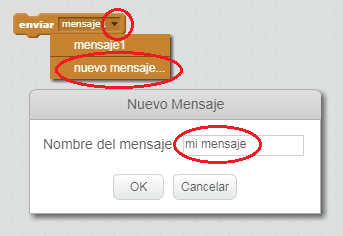
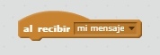
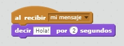

Una transmisión es una forma de enviar una señal desde un objeto que puede ser escuchada por todos los objetos. Piensa en ello como un anuncio hecho por un altavoz.

### Enviar una transmisión

Puedes enviar una transmisión creando un bloque de envío y dándole un nombre.

+ Encuentra el bloque de envío en la pestaña Eventos.

+ Selecciona **nuevo mensaje...** en el menú desplegable y escribe tu mensaje.

El texto del mensaje puede ser lo que quieras, pero es útil darle a la transmisión un texto descriptivo. Lo que sucede cuando se recibe el mensaje depende del código que hayas escrito.

### Recibe una transmisión

Un objeto puede reaccionar a un envío usando este bloque:

Puedes agregar bloques debajo de este bloque para decirle al objeto qué hacer cuando recibe la señal transmitida.

