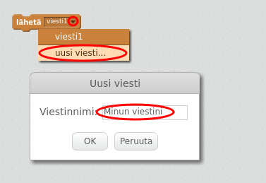
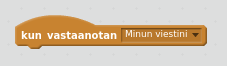
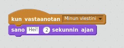

Lähetys on tapa lähettää hahmosta viesti, signaali, jonka kaikki hahmot voivat kuulla. Ajattele sen olevan kuin kaiuttimen kautta tehty ilmoitus.

### Lähetä viesti

Voit lähettää viestin luomalla lähetyslohkon ja antamalla sille nimen.

+ Etsi lähetyslohko Tapahtumat-välilehdeltä.

+ Valitse **uusi viesti** avattavasta valikosta ja nimeä viesti.

Viestin nimi voi olla mikä tahansa, mutta on hyödyllistä antaa lähetykselle järkevä kuvaus. Mitä tapahtuu, kun viesti vastaanotetaan, riippuu kirjoittamastasi koodista.

### Vastaanota viesti

Hahmo voi reagoida viestiin käyttämällä tätä lohkoa:

Voit lisätä lohkoja tämän lohkon alapuolelle kertoaksesi hahmolle mitä tehdä, kun se vastaanottaa lähetyssignaalin.

