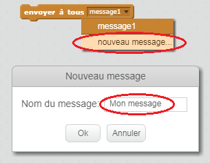

Un envoi à tous est un moyen pour un lutin d'envoyer un message qui peut être entendu par tous les autres lutins. Imagine que c'est comme une annonce faite par haut-parleur.

### Envoyer un message à tous

Tu peux faire un envoi à tous en créant un bloc envoyer à tous et en lui attribuant un nom.

+ Trouve le bloc d'envoi à tous dans l'onglet Événements.

+ Sélectionne **nouveau message** dans le menu déroulant puis tape ton message.

Le message peut contenir ce que tu veux, mais il est important de d'associer une description pertinente à ton envoi. Ce qui se passe lorsque le message est reçu dépend du code que tu écriras.

### Recevoir un message

Un lutin peut réagir à un envoi à tous en utilisant ce bloc:

Tu peux ajouter des blocs en dessous de celui-ci pour indiquer au lutin ce qu'il doit faire lorsqu'il reçoit un message envoyé à tous.

