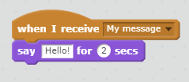

שידור הוא דרך של שליחת אות מתוך ספרייט אשר ניתן לשמוע על ידי כל שדונים. תחשוב על זה כמו הודעה על רמקול.

### שלח שידור

ניתן לשלוח שידור על ידי יצירת בלוק שידור ולתת לו שם.

+ אתר את בלוק השידור בכרטיסייה אירועים.

+ בחר **הודעה חדשה** בתפריט הנפתח ולאחר מכן הקלד את ההודעה.

טקסט ההודעה יכול להיות כל דבר שאתה אוהב, אבל זה שימושי כדי לתת את השידור תיאור הגיוני. מה קורה כאשר ההודעה מתקבלת תלוי בקוד שאתה כותב.

### קבל שידור

שדון יכול להגיב על שידור באמצעות בלוק זה:

אתה יכול להוסיף בלוקים מתחת לחסום זה לספר ספרייט מה לעשות כאשר הוא מקבל את שידור האות.

