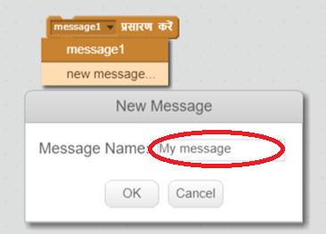
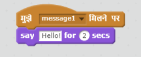

प्रसारण स्प्राइट से संदेश भेजने का तरीका है, जिसे सभी स्प्राइट्स सुन सकें। इसे लाउडस्पीकर पर की गई घोषणा के तौर पर सोचें।

### प्रसारण भेजें
आप प्रसारण ब्लॉक बनाकर और इसे नाम देकर प्रसारण भेज सकते हैं।

+ Events टैब में प्रसारण ब्लॉक खोजें।

+ ड्रॉप-डाउन मेनू में **new message** का चयन करें, इसके बाद अपना संदेश टाइप करें।

संदेश का टेक्स्ट आपकी इच्छानुसार कुछ भी हो सकता है, परन्तु प्रसारण में विवेकपूर्ण विवरण देना उपयोगी होता है। तब क्या होता है जब प्राप्त किया गया संदेश आपके लिखे गए कोड पर आधारित होता है।

### प्रसारण प्राप्त करें

स्प्राइट इस ब्लॉक द्वारा प्रसारण पर प्रतिक्रिया दे सकता है:

आप स्प्राइट को यह बताने के लिए इस ब्लॉक के नीचे ब्लॉक्स शामिल कर सकते हैं कि प्रसारण संदेश प्राप्त करने पर इसे क्या करना है।

