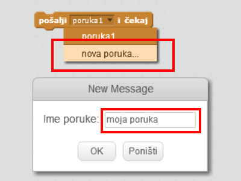
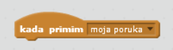
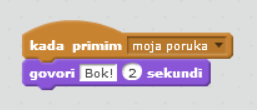

Slanjem poruke lik šalje signal kojeg mogu čuti svi likovi. Zamisli to kao objavu preko razglasa.

### Pošalji poruku

Možeš poslati poruku tako da izradiš blok za emitiranje i daš mu ime.

+ Pronađi blok za slanje poruke na kartici Događaji.

+ Na padajućem izborniku odaberi **nova poruka**, a zatim upiši svoju poruku.

Tekst poruke može biti što god želiš, ali korisno je postaviti razumni opis. Što se događa kad je poruka primljena, ovisi o napisanom kôdu.

### Primi poruku

Lik može reagirati na slanje poruke pomoću ovog bloka:

Možeš dodati blokove ispod ovog bloka kako bi odredio što lik treba učiniti kada primi poruku.

