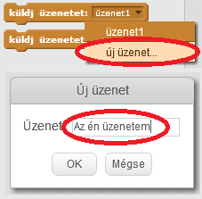
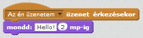

A sugárzás módja annak, hogy egy sprite-ből juttassanak jelet, amelyet minden sprites hallhat. Gondolj rá, mint egy kihangosítóval kapcsolatos bejelentés.

### Küldj egy adást

Küldést küldhet egy broadcast blokk létrehozásával és egy nevet ad.

+ Keresse meg a műsorblokkot az Események lapon.

+ Válasszon **új üzenetet** a legördülő menüből, majd írja be az üzenetet.

Az üzenet szövege tetszés szerint tetszhet, de érdemes leírást adni a műsorra. Mi történik, ha az üzenet érkezik, attól függ, hogy milyen kódot ír.

### Fogadjon egy adást

Ez a blokk használatával egy sprite reagálhat a műsorra:

A blokk alatt megadhat blokkokat, hogy elmondja a sprite-nek, mit kell tennie a sugárzott jelek fogadásakor.

