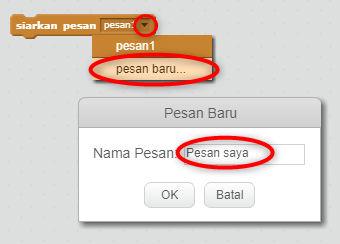
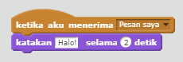

Siaran adalah cara mengirim sinyal dari sprite yang bisa didengar oleh semua sprite. Anggap saja seperti pengumuman yang dibuat melalui loudspeaker.

### Kirim siaran

Anda dapat mengirim siaran dengan membuat blok siaran dan memberinya sebuah nama.

+ Temukan blok siaran di tab Acara.

+ Pilih **pesan baru** di menu drop-down, lalu ketik pesan Anda.

Teks pesan bisa menjadi apapun yang Anda suka, namun berguna untuk memberi penyiaran deskripsi yang masuk akal. Apa yang terjadi bila pesan diterima tergantung dari kode yang Anda tulis.

### Terima siaran

Sprite dapat bereaksi terhadap siaran dengan menggunakan blok ini:

Anda bisa menambahkan blok di bawah blok ini untuk memberi tahu sprite apa yang harus dilakukan saat menerima sinyal siaran.

