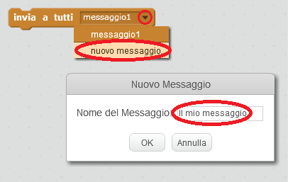
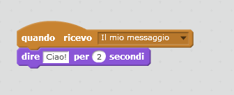

L'opzione "invia a tutti" permette di inviare un messaggio che parte da uno sprite e può essere ascoltato da tutti gli altri sprite. Non è molto diverso da un annuncio fatto tramite altoparlante!

### Inviare un messaggio

È possibile inviare un messaggio creando un blocco "invia a tutti" e assegnando un nome al messaggio.

+ Trova il blocco "invia a tutti" nella scheda Situazioni.

+ Seleziona **nuovo messaggio** nel menu a tendina e digita il tuo messaggio.

Puoi dare al tuo messaggio il contenuto che preferisci, ma è importante che questo contenuto abbia senso. Quello che succede quando il messaggio viene ricevuto dipende dal codice che scegli di scrivere.

### Ricevere un messaggio

Uno sprite può reagire ad un messaggio usando questo blocco:

È possibile aggiungere altri blocchi sotto questo blocco per dire allo sprite cosa fare quando riceve il messaggio trasmesso.

