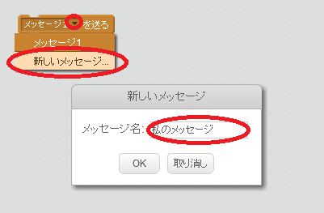
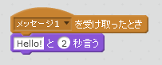

ブロードキャストとは、すべてのスプライトで聞こえるスプライトからの信号を送信する方法です。それをスピーカーで発表するように考えてください。

### 放送を送る

ブロードキャストブロックを作成して名前を付けることで、ブロードキャストを送信できます。

+ [Events]タブでブロードキャストブロックを探します。

+ プルダウンメニューで **新しいメッセージ** を選択し、メッセージを入力します。

メッセージテキストには好きなものを入れることができますが、放送に分かりやすい説明を付けると便利です。メッセージを受け取ったときに起こることは、あなたが書いたコードに依存します。

### 放送を受ける

スプライトはこのブロックを使用してブロードキャストに反応することができます：

このブロックの下にブロックを追加して、スプライトがブロードキャスト信号を受信したときに何をすべきかを指示できます。

