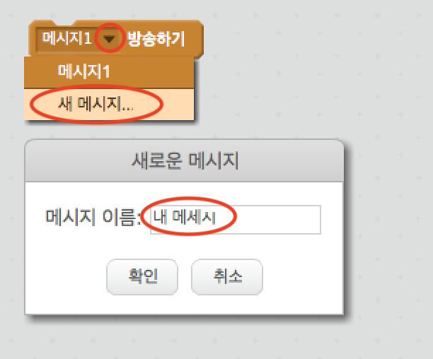
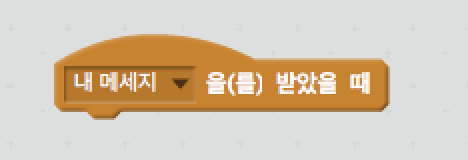
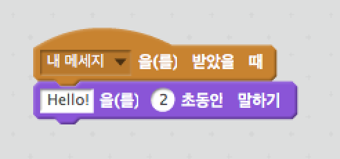

"방송"은 한 스프라이트로부터 모든 스프라이트가 들을 수 있는 신호를 보내는 방법입니다. 메가폰으로 들을 수 있는 발표라고 보시면 됩니다.

### 메시지 방송하기

방송 블록을 만들고 이름을 지정하여 메시지를 보낼 수 있습니다.

+ 이벤트 탭에서 방송 블록을 찾으십시오.

+ 메뉴에서 **새 메시지** 를 선택한 다음 메시지를 입력하십시오.

메시지는 원하는 대로 작성할 수 있지만, 방송되는 메시지를 이해하기 쉬운 설명을 써주는 것이 유용합니다. 메시지를 받을 때 일어나는 일은 작성한 코드에 따라 다릅니다.

### 메시지 받기

스프라이트는 이 블록을 사용하여 방송된 메시지에 반응할 수 있습니다.

이 블록 아래에 블록을 추가하여 스프라이트가 메시지를 받을 때 수행 할 작업을 지시 할 수 있습니다.

