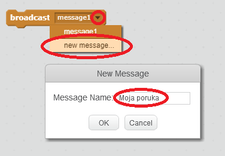
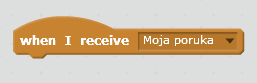
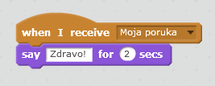

Slanjem poruke lik šalje signal koji mogu da čuju svi ostali likovi. Zamisli to kao obavještavanje preko razglasa.

### Pošalji poruku

Poruku možeš da pošalješ tako što ćeš izraditi blok broadcast (pošalji) i dati mu naziv.

+ Pronađi blok broadcast (pošalji) na kartici Events (Događaji).

+ U padajućem meniju izaberi **new message** (nova poruka), a zatim upiši svoju poruku.

Tekst poruke može biti šta god želiš, ali je korisno da sadržaj poruke bude smislen. Šta se dešava kada je poruka primljena, zavisi od kôda koji napišeš.

### Primi poruku

Lik može da reaguje na slanje poruke korišćenjem ovog bloka:

Možeš da dodaš blokove ispod ovog bloka da odrediš šta lik treba da uradi kada primi poruku.

