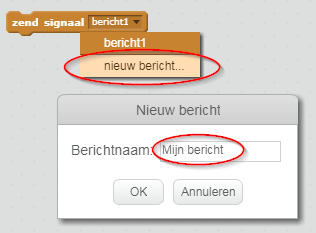
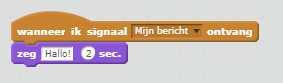

Een uitzending is een manier om een ​​signaal van een sprite te verzenden dat door alle sprites kan worden gehoord. Zie het als een aankondiging via een luidspreker.

### Verzend een signaal (bericht)

Je kunt een signaal verzenden door een zend signaal blok te maken en het een naam te geven.

+ Zoek het zend signaal blok op in het tabblad Gebeurtenissen.

+ Selecteer **nieuw bericht** in het keuzemenu en typ vervolgens jouw bericht.

De berichttekst kan van alles zijn wat jij maar wilt, maar het is handig om het bericht een verstandige beschrijving te geven. Wat er gebeurt als het bericht wordt ontvangen, is afhankelijk van de code die jij schrijft.

### Een bericht ontvangen

Een sprite kan reageren op een bericht door dit blok te gebruiken:

Je kunt blokken onder dit blok toevoegen om de sprite te vertellen wat hij moet doen als hij het bericht ontvangt.

