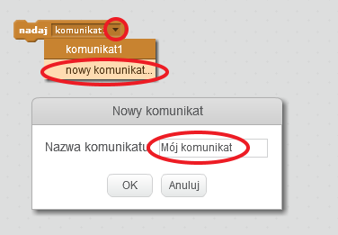
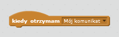
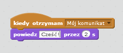

Transmisja jest sposobem na wysłanie sygnału z duszka, który może być słyszany przez wszystkie duszki. Pomyśl o tym jak o zapowiedzi nad głośnikiem.

### Wyślij transmisję

Możesz wysłać transmisję, tworząc blok transmisji i nadając mu nazwę.

+ Znajdź blok emisji w zakładce Zdarzenia.

+ Wybierz **nową wiadomość** z menu rozwijanego, a następnie wpisz swoją wiadomość.

Tekst wiadomości może być dowolny, ale dobrze jest nadać audycji sensowny opis. Co się stanie, gdy wiadomość zostanie odebrana, zależy od kodu, który napiszesz.

### Odbierz transmisję

Sprajt może zareagować na transmisję za pomocą tego bloku:

Możesz dodać bloki poniżej tego bloku, aby powiedzieć sprite'owi, co zrobić, gdy odbierze sygnał rozgłoszeniowy.

