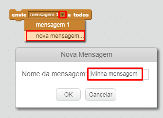
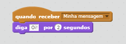

Uma transmissão é uma forma de enviar um sinal de um sprite que pode ser ouvido por todos os sprites. Pense nisso como um anúncio feito através de um alto-falante.

### Enviar uma transmissão

Você pode enviar uma transmissão criando um bloco de transmissão e dando-lhe um nome.

+ Encontre o bloco de transmissão na guia Eventos.

+ Selecione **nova mensagem** no menu suspenso e digite sua mensagem.

O texto da mensagem pode ser qualquer coisa que você quiser, mas é útil dar à transmissão uma descrição sensível. O que acontece quando a mensagem é recebida depende do código que você escreve.

### Receba uma transmissão

Um sprite pode reagir a uma transmissão usando este bloco:

Você pode adicionar blocos abaixo deste bloco para dizer ao sprite o que fazer quando recebe o sinal de transmissão.

