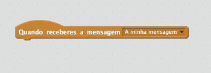

Uma difusão de uma mensagem é uma forma de enviar um sinal a partir de um sprite que pode ser ouvido por todos os sprites. Imagina que é um anúncio feito através de um alto-falante.

### Difundir uma mensagem

Podes difundir uma mensagem criando um bloco de difusão de mensagem dando-lhe um nome.

+ Procura o bloco de difusão no menu Eventos.

+ Seleciona **new message** no menu e escreve a tua mensagem.

O texto da mensagem pode ser o que tu quiseres, mas é útil dar à transmissão uma descrição precisa. O que acontece quando a mensagem é recebida depende do código que escreveres.

### Receber uma transmissão

Uma sprite pode reagir a uma transmissão usando este bloco:

Podes adicionar blocos debaixo deste bloco para dizer ao sprite o que fazer quando receber o sinal de transmissão.

