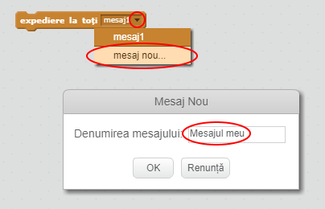
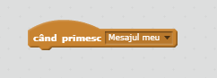
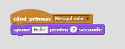

Transmisiunea este o modalitate de a trimite un semnal de la un personaj, care poate fi auzit de toate personajele. Gândiți-vă ca la un anunț făcut prin megafon.

### Transmiteti un mesaj

Puteți transmite un mesaj creând un bloc de transmisiune și dându-i un nume.

+ Găsiți blocul pentru transmisiune în tab-ul Evenimente.

+ Selectați **mesaj nou** din meniul derulant, apoi introduceți mesajul.

Textul mesajului poate fi orice v-ar plăcea, dar este util să oferiți transmisiunii o descriere potrivită. Ce se întâmplă atunci când mesajul este receptionat, depinde de codul pe care îl scrieți.

### Receptionarea unei transmisiuni

Un personaj poate reacționa la o transmisiune folosind acest bloc:

Puteți adăuga blocuri sub acest bloc pentru a spune personajului ce trebuie să facă atunci când primește semnalul transmis.

