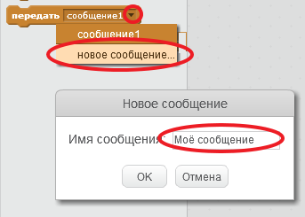
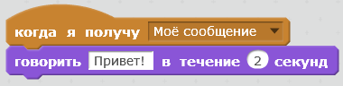

Передача (от английского слова broadcast) - это способ отправки сигнала из спрайта, который могут услышать все остальные спрайты. Это как объявление, которое могут слышать все. Например, в общественном транспорте или на вокзале ("Уважаемые пассажиры, поезд Москва-Лондон прибывает к первому пути").

### Передаём сообщение

Ты можешь передать сообщение, создав блок передачи и присвоив ему имя.

+ Найди блок передачи на вкладке «События».

+ Щёлкни по раскрывающемуся списку, выбери пункт **новое сообщение**, а затем введи своё сообщение.

Текст сообщения может быть любым, но лучше, чтобы это сообщение имело какой-то смысл. Реакция на ваше сообщение зависит от кода, который ты напишешь.

### Получение сообщения

Спрайт может реагировать на сообщения с помощью этого блока:

Под этим блоком ты можешь добавить блок, который сообщит спрайту, что делать, когда он принимает сообщение.

