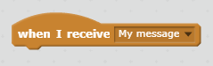

Vysielanie je spôsob vysielania signálu zo sprite, ktorý môže počuť všetci sprites. Premýšľajte o tom ako o oznámení na reproduktor.

### Odoslať vysielanie

Vysielanie môžete odoslať vytvorením rozhlasového bloku a uvedením mena.

+ Nájdite blok vysielania na karte Udalosti.

+ Vyberte v rozbaľovacej ponuke **novú správu** a potom zadajte svoju správu.

Text správy môže byť čokoľvek, čo sa vám páči, ale je užitočné dať vysielaniu rozumný popis. Čo sa stane po prijatí správy, závisí od kódu, ktorý ste napísali.

### Prijmite vysielanie

Sprite môže reagovať na vysielanie pomocou tohto bloku:

Môžete pridať bloky pod týmto blokom, aby ste povedali, čo má robiť, keď dostane signál vysielania.

