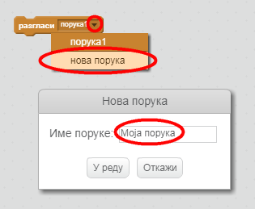
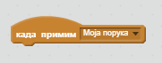
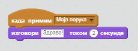

Емитовање је начин слања сигнала из спита који се могу чути од стране свих спритова. Помислите на то као најаву над звучником.

### Пошаљите емисију

Можете емитовати емитовање тако што ћете креирати блок за емитовање и дати им име.

+ Пронађите блок емитовања на картици Догађаји.

+ У падајућем менију изаберите **нова порука** , а затим унесите своју поруку.

Текст поруке може бити све што вам се свиђа, али корисно је емитовање емитованог описа. Шта се дешава када примите поруку зависи од кода који пишете.

### Примите емисију

Сприте може да реагује на емисију коришћењем овог блока:

Можете додати блокове испод овог блока да бисте испричали сприту шта треба урадити када прими емитовани сигнал.

