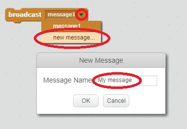

En sändning är ett sätt att skicka en signal från en sprite som kan höras av alla sprites. Tänk på det som ett meddelande om en högtalare.

### Skicka en sändning

Du kan skicka en sändning genom att skapa ett sändningsblock och ge det ett namn.

+ Hitta sändningsblocket på fliken Evenemang.

+ Välj **nytt meddelande** i rullgardinsmenyn och skriv sedan ditt meddelande.

Meddelandetexten kan vara allt du vill, men det är användbart att ge sändningen en förnuftig beskrivning. Vad som händer när meddelandet mottas beror på koden du skriver.

### Ta emot en sändning

En sprite kan reagera på en sändning med hjälp av det här blocket:

Du kan lägga till block under det här blocket för att berätta vad du ska göra när du tar emot sändningssignalen.

