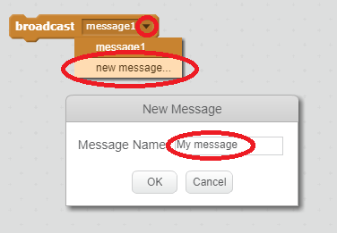

Bir yayın, tüm sprite'ların duyabileceği bir spritedan bir sinyal göndermenin bir yoludur. Bir hoparlör üzerinden yapılan bir duyuru gibi düşünün.

### Bir yayın gönder

Bir yayın bloğu oluşturarak ve ona bir isim vererek yayın gönderebilirsiniz.

+ Etkinlikler sekmesinde yayın bloğunu bulun.

+ Açılır menüden **yeni mesaj** seçin, ardından mesajınızı yazın.

Mesaj metni hoşunuza giden herhangi bir şey olabilir, ancak yayına mantıklı bir açıklama vermek yararlıdır. Mesaj alındığında yazdığınız koda bağlı olarak değişir.

### Bir yayın almak

Bir sprite, bu bloğu kullanarak bir yayına tepki verebilir:

Yayını, yayın sinyalini aldığında ne yapması gerektiğini söylemek için bu bloğun altına bloklar ekleyebilirsiniz.

