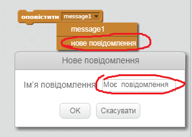
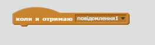
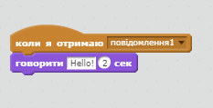

Трансляція - це спосіб надсилання сигналу з режиму спрайту, який може бути почутий усіма справами. Подумайте про це, як про оголошення над гучномовцем.

### Відправити трансляцію

Ви можете відправити трансляцію, створивши широкомовний блок і надавши йому назву.

+ Знайдіть блок трансляції на вкладці Події.

+ У спадному меню виберіть **нове повідомлення** , а потім введіть своє повідомлення.

Текст повідомлення може бути будь-яким, що вам подобається, але корисно надати трансляцію розумне опис. Що трапляється, коли отримане повідомлення залежить від коду, який ви пишете.

### Отримайте трансляцію

Спайт може реагувати на трансляцію за допомогою цього блоку:

Ви можете додати блоки внизу цього блоку, щоб повідомити справі, що робити, коли він отримує широкомовний сигнал.

