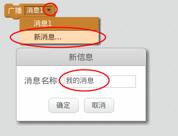
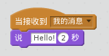

广播可用于传达来自子图的信号，且可被所有子图听到。将它看作通过扬声器发出的一条公告。

### 发送广播
你可以通过创建广播代码块并给它命名来发送一条广播。

+ 在事件选项卡中找到广播代码块。

+ 在下拉菜单中选择**新消息**，然后输入你的消息。

消息文本可以是你喜欢的任何内容，但对广播内容进行合理的描述会很有用。当该消息被接收时会发生什么取决于你编写的代码。

### 接收广播

可使用以下代码块来使子图对广播作出反应：

你可以在此代码块下方添加代码块，来告诉子图在收到广播信号时做什么。

